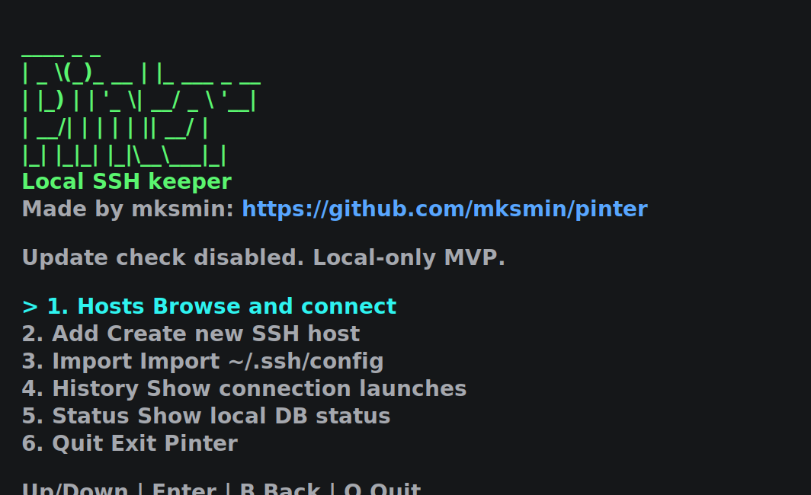
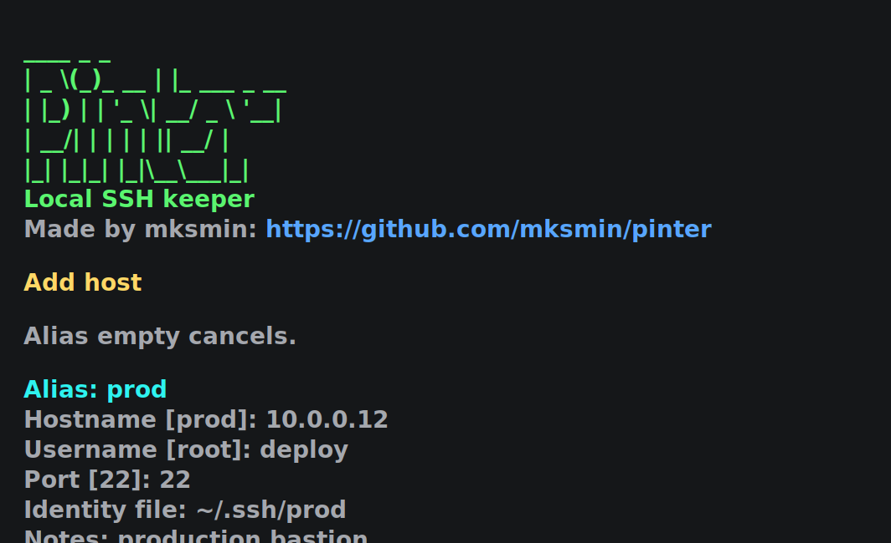
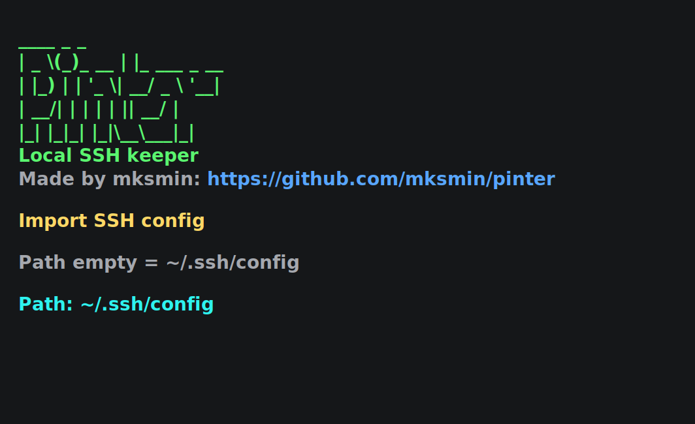
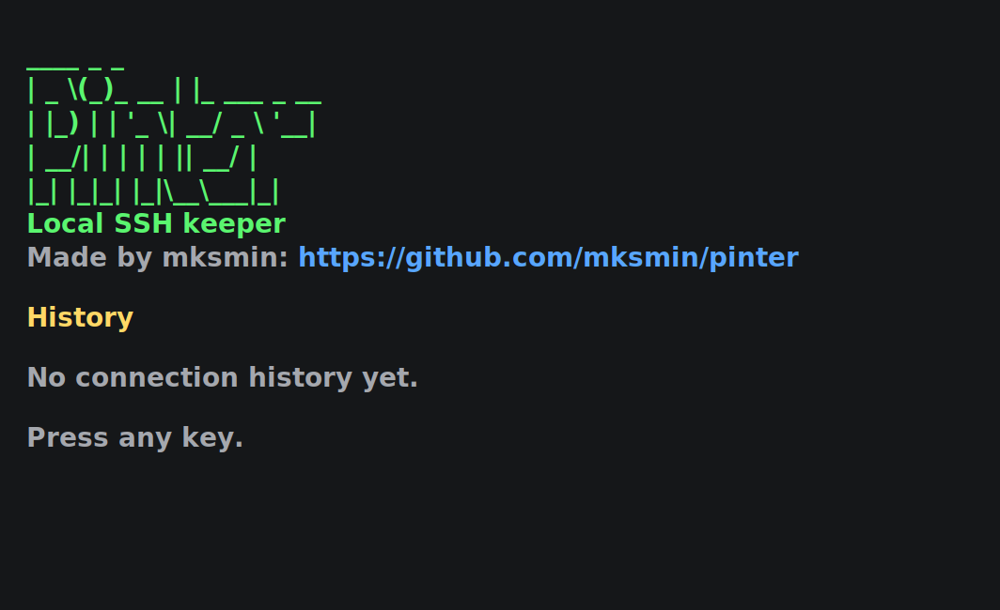
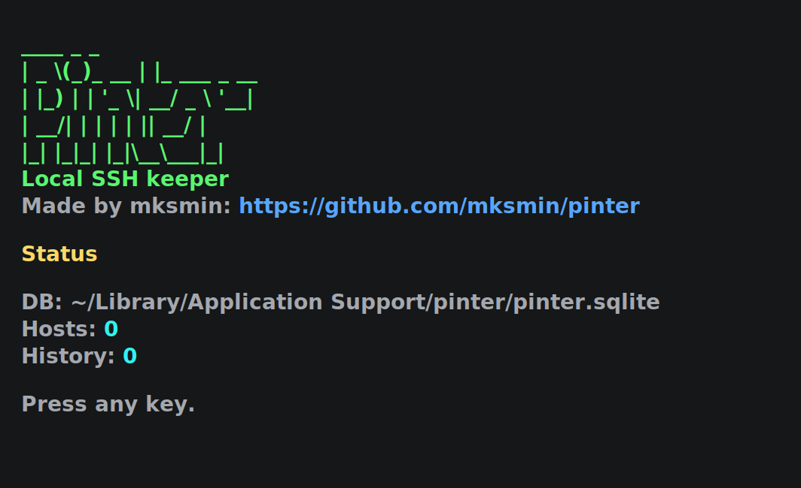

# Pinter

Local SSH keeper MVP. CLI + colorful TUI. Stores hosts in SQLite, imports `~/.ssh/config` on explicit command, opens SSH in macOS Terminal via system `ssh`.

No GUI frameworks. No Wails. No frontend.

## Screenshots

Main menu:



Add host:



Import SSH config:



History:



Status:



## Status

Current focus: CLI + TUI MVP.

Done:

- Colorful TUI main menu.
- TUI host add/list/details/connect/history/status.
- TUI hidden cursor in menu screens.
- Explicit SSH config import.
- SQLite local DB.
- macOS Terminal.app launch.

Next work lives in [docs/ROADMAP.md](docs/ROADMAP.md).

## Requirements

- Go 1.26+
- macOS Terminal.app for `connect`

## Install

Install latest release on macOS or Linux:

```bash
curl -fsSL https://raw.githubusercontent.com/mksmin/pinter/master/scripts/install.sh | sh
```

Install a specific version:

```bash
PINTER_VERSION=v0.1.1 sh -c "$(curl -fsSL https://raw.githubusercontent.com/mksmin/pinter/master/scripts/install.sh)"
```

Install to a custom directory:

```bash
PINTER_INSTALL_DIR="$HOME/bin" sh -c "$(curl -fsSL https://raw.githubusercontent.com/mksmin/pinter/master/scripts/install.sh)"
```

Windows PowerShell:

```powershell
iwr https://raw.githubusercontent.com/mksmin/pinter/master/scripts/install.ps1 -UseB | iex
```

If `pinter` is not found after install, add the install directory to `PATH`.

## Data

Default DB path:

```text
~/Library/Application Support/pinter/pinter.sqlite
```

Use temp DB for testing:

```bash
export PINTER_DB_PATH="/private/tmp/pinter-dev.sqlite"
```

Use project-local DB:

```bash
export PINTER_DATA_DIR="$PWD/.cache/pinter"
```

`GOCACHE="$PWD/.cache/go-build"` only needed inside restricted sandbox. Normal local run does not need it.

## Run

Open TUI:

```bash
go run ./cmd/pinter
```

TUI controls:

```text
Up/Down or K/J
Enter select / details
C Connect
B Back
Q Quit
```

Help:

```bash
go run ./cmd/pinter help
```

Add host:

```bash
go run ./cmd/pinter add \
  --alias local \
  --host 127.0.0.1 \
  --user "$USER" \
  --notes "Local smoke test"
```

List hosts:

```bash
go run ./cmd/pinter list
```

Search:

```bash
go run ./cmd/pinter list -q local
```

Import SSH config, explicit only:

```bash
go run ./cmd/pinter import-ssh-config
```

Use custom SSH config path:

```bash
go run ./cmd/pinter import-ssh-config --path ./my-ssh-config
```

Connect:

```bash
go run ./cmd/pinter connect local
```

This opens Terminal.app with system `ssh`.

History:

```bash
go run ./cmd/pinter history
```

## Build Binary

```bash
make build
```

Open TUI from built binary:

```bash
./build/pinter
```

Run built binary command:

```bash
./build/pinter list
```

## Release Builds

Tagged releases publish binaries for:

- macOS amd64/arm64
- Linux amd64/arm64
- Windows amd64

Release assets are attached by GitHub Actions with `checksums.txt`.

## Verify

Run tests:

```bash
go test ./...
```

Build all packages:

```bash
go build ./...
```

Build CLI binary:

```bash
make build
```

Run TUI smoke manually:

```bash
go run ./cmd/pinter
```

Then press `Q`.

## Smoke Test

```bash
export PINTER_DB_PATH="/private/tmp/pinter-smoke.sqlite"
rm -f "$PINTER_DB_PATH"

go run ./cmd/pinter add \
  --alias smoke \
  --host 127.0.0.1 \
  --user "$USER" \
  --notes "smoke test"

go run ./cmd/pinter list
go run ./cmd/pinter history
```

Optional Terminal check:

```bash
go run ./cmd/pinter connect smoke
```

## Current Limits

- TUI only. No GUI.
- No passwords/passphrases stored.
- Uses local `ssh`, key files, and `ssh-agent`.
- SSH config import skips wildcard hosts like `Host *` and `Host prod-*`.
- SSH config `Include` is not supported yet.
- History records launch time, not remote shell exit code.
- Screenshots are static SVG previews, not generated by terminal capture.

## Docs

- [Project structure](docs/PROJECT_STRUCTURE.md)
- [Development roadmap](docs/ROADMAP.md)
- [Changelog](CHANGELOG.md)
